# Market Analysis Model Restructuring Plan

## Overview

This document outlines a comprehensive plan to restructure the current cryptocurrency price prediction system (`asd.py`) into a more professional, modular, and scalable architecture. The new structure will support ensemble models and advanced ML techniques beyond LSTM, making the system more maintainable and extensible.

## Current Structure Analysis

The current `asd.py` file contains a single `CryptoPricePredictor` class that handles everything:
- Data fetching from Binance API
- Data preprocessing
- Model building (LSTM only)
- Training with cross-validation
- Prediction
- Trading simulation
- Visualization
- Technical indicators

This monolithic approach makes it difficult to:
- Add new model types
- Create ensemble models
- Extend functionality
- Maintain the codebase
- Test individual components

## Proposed New Structure

The code will be restructured into a modular package with the following components:

```mermaid
graph TD
    A[Market Analysis System] --> B[Data Module]
    A --> C[Models Module]
    A --> D[Training Module]
    A --> E[Evaluation Module]
    A --> F[Trading Module]
    A --> G[Visualization Module]
    
    B --> B1[Data Fetchers]
    B --> B2[Data Processors]
    B --> B3[Feature Engineering]
    
    C --> C1[Base Model]
    C --> C2[LSTM Model]
    C --> C3[Other ML Models]
    C --> C4[Ensemble Models]
    
    D --> D1[Training Strategies]
    D --> D2[Cross Validation]
    D --> D3[Hyperparameter Tuning]
    
    E --> E1[Performance Metrics]
    E --> E2[Backtesting]
    
    F --> F1[Trading Strategies]
    F --> F2[Risk Management]
    F --> F3[Portfolio Management]
    
    G --> G1[Price Charts]
    G --> G2[Performance Visualization]
    G --> G3[Trading Results]
```



## Detailed Component Breakdown

### 1. Project Structure

```
market_analysis/
├── __init__.py
├── config.py                  # Configuration settings
├── main.py                    # Main entry point
├── data/
│   ├── __init__.py
│   ├── fetchers/              # Data fetching from different sources
│   │   ├── __init__.py
│   │   ├── base_fetcher.py    # Abstract base class
│   │   ├── binance_fetcher.py # Binance implementation
│   │   └── csv_fetcher.py     # Local CSV files
│   ├── processors/            # Data preprocessing
│   │   ├── __init__.py
│   │   ├── base_processor.py  # Abstract base class
│   │   └── price_processor.py # Price data processing
│   └── features/              # Feature engineering
│       ├── __init__.py
│       ├── technical_indicators.py
│       └── feature_selector.py
├── models/
│   ├── __init__.py
│   ├── base_model.py          # Abstract base model
│   ├── lstm_model.py          # LSTM implementation
│   ├── gru_model.py           # GRU implementation
│   ├── transformer_model.py   # Transformer implementation
│   ├── xgboost_model.py       # XGBoost implementation
│   └── ensemble/
│       ├── __init__.py
│       ├── stacking.py        # Stacking ensemble
│       └── voting.py          # Voting ensemble
├── training/
│   ├── __init__.py
│   ├── trainer.py             # Model training orchestration
│   ├── cross_validation.py    # Cross-validation strategies
│   └── hyperparameter_tuning.py # Hyperparameter optimization
├── evaluation/
│   ├── __init__.py
│   ├── metrics.py             # Performance metrics
│   └── backtesting.py         # Backtesting framework
├── trading/
│   ├── __init__.py
│   ├── strategies/
│   │   ├── __init__.py
│   │   ├── base_strategy.py   # Abstract strategy
│   │   ├── trend_following.py # Trend-following strategy
│   │   └── mean_reversion.py  # Mean-reversion strategy
│   ├── risk_management.py     # Risk management tools
│   └── portfolio.py           # Portfolio management
└── visualization/
    ├── __init__.py
    ├── price_charts.py        # Price visualization
    ├── performance_charts.py  # Model performance visualization
    └── trading_charts.py      # Trading results visualization
```

### 2. Key Components

#### Data Module
- **Base Fetcher**: Abstract class defining the interface for data fetchers
- **Binance Fetcher**: Implementation for Binance API
- **Data Processor**: Handles data cleaning, normalization, and preparation
- **Feature Engineering**: Technical indicators and feature creation

#### Models Module
- **Base Model**: Abstract class defining the interface for all models
- **LSTM Model**: Current LSTM implementation
- **Additional Models**: GRU, Transformer, XGBoost, etc.
- **Ensemble Models**: Stacking and voting ensembles

#### Training Module
- **Trainer**: Orchestrates the training process
- **Cross Validation**: Time-series cross-validation
- **Hyperparameter Tuning**: Optimization of model parameters

#### Evaluation Module
- **Metrics**: RMSE, MAE, R², etc.
- **Backtesting**: Framework for historical backtesting

#### Trading Module
- **Trading Strategies**: Different trading approaches
- **Risk Management**: Stop-loss, position sizing
- **Portfolio Management**: Asset allocation

#### Visualization Module
- **Price Charts**: Visualization of price data
- **Performance Charts**: Model performance visualization
- **Trading Charts**: Trading results visualization

## Implementation Plan

### Phase 1: Core Structure and Data Module
1. Set up the project structure
2. Implement the data fetching and processing components
3. Migrate the existing data functionality from `asd.py`

### Phase 2: Models and Training
1. Implement the base model interface
2. Migrate the LSTM model from `asd.py`
3. Implement additional model types
4. Create the training framework

### Phase 3: Evaluation and Trading
1. Implement the evaluation metrics
2. Create the backtesting framework
3. Migrate the trading strategies from `asd.py`

### Phase 4: Visualization and Integration
1. Implement the visualization components
2. Create a unified API for the entire system
3. Develop example scripts and documentation

## Benefits of the New Structure

1. **Modularity**: Each component has a single responsibility
2. **Extensibility**: Easy to add new models, data sources, or strategies
3. **Maintainability**: Smaller, focused files are easier to understand and maintain
4. **Testability**: Components can be tested in isolation
5. **Scalability**: The system can grow without becoming unwieldy
6. **Flexibility**: Support for ensemble models and advanced techniques

## Example Usage

```python
# Example of how the new system could be used
from market_analysis.data.fetchers import BinanceFetcher
from market_analysis.data.processors import PriceProcessor
from market_analysis.models import LSTMModel, XGBoostModel
from market_analysis.models.ensemble import StackingEnsemble
from market_analysis.training import Trainer
from market_analysis.evaluation import Backtester
from market_analysis.trading.strategies import TrendFollowing
from market_analysis.visualization import PerformanceCharts

# Fetch and process data
fetcher = BinanceFetcher(symbol="BTCUSDT", interval="1d")
data = fetcher.fetch_data(start_date="2020-01-01")
processor = PriceProcessor(window_size=60)
X_train, X_val, X_test, y_train, y_val, y_test = processor.process(data)

# Create models
lstm_model = LSTMModel(input_shape=(60, 1), units=50, dropout=0.2)
xgb_model = XGBoostModel(max_depth=6, n_estimators=100)

# Create ensemble
ensemble = StackingEnsemble([lstm_model, xgb_model])

# Train the ensemble
trainer = Trainer(model=ensemble, epochs=100, batch_size=32)
trainer.train(X_train, y_train, X_val, y_val)

# Evaluate
predictions = ensemble.predict(X_test)
metrics = trainer.evaluate(y_test, predictions)

# Backtest a trading strategy
strategy = TrendFollowing(stop_loss=0.05)
backtester = Backtester(strategy=strategy, initial_balance=100.0)
results = backtester.run(data, predictions)

# Visualize results
charts = PerformanceCharts()
charts.plot_predictions(data, predictions)
charts.plot_trading_results(results)
```

## Advanced ML Techniques Implementation

### 1. Ensemble Models

#### Stacking Ensemble
The stacking ensemble will combine multiple base models:
- LSTM for sequence learning
- GRU for potentially better performance on shorter sequences
- Transformer for capturing long-range dependencies
- XGBoost/LightGBM for tree-based modeling
- Linear models for baseline comparison

The implementation will:
1. Train each base model independently
2. Use their predictions as features for a meta-model
3. Train the meta-model to produce the final prediction

#### Voting Ensemble
For simpler ensembling:
1. Train multiple models independently
2. Average their predictions (weighted or unweighted)
3. Use the averaged prediction for trading decisions

### 2. Advanced Neural Network Architectures

#### Transformer Models
Implement transformer-based models that can:
- Capture long-range dependencies in time series data
- Process multiple timeframes simultaneously
- Incorporate attention mechanisms to focus on relevant patterns

#### Temporal Convolutional Networks (TCN)
TCNs offer advantages for time series:
- Parallelizable training (unlike RNNs)
- Flexible receptive field
- Stable gradients

#### Hybrid Models
Combine different architectures:
- CNN-LSTM: CNN for feature extraction, LSTM for sequence modeling
- Attention-LSTM: LSTM with attention mechanism
- Transformer-XGBoost: Transformer for feature extraction, XGBoost for prediction

### 3. Advanced Training Techniques

#### Transfer Learning
Implement transfer learning to:
- Pre-train models on general market data
- Fine-tune on specific assets
- Share knowledge between related markets

#### Bayesian Optimization
For hyperparameter tuning:
- More efficient than grid or random search
- Probabilistic model of the objective function
- Sequential selection of hyperparameters

#### Adversarial Training
Improve model robustness:
- Generate adversarial examples (e.g., simulated market shocks)
- Train models to perform well even under these conditions

## Next Steps

1. Create the directory structure
2. Implement the core components
3. Migrate existing functionality
4. Add new models and techniques
5. Develop comprehensive tests
6. Create documentation and examples